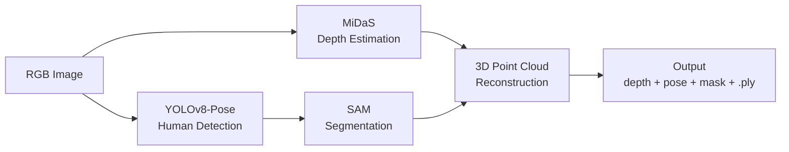

# Human3D – Context-Aware 3D Reconstruction from a Single Image

[](https://www.python.org/downloads/)
[](https://pytorch.org/)
[](LICENSE)
[](https://github.com/Ashritha-sai/Human3D---Reconstruction/actions/workflows/ci.yml)

**Human3D** is a modular, end-to-end pipeline for reconstructing 3D human geometry from a single RGB image.
The system supports both **single-person** and **multi-person** scenes and is designed as a clean research foundation for future biomechanically-aware and differentiable human modeling.

This repository focuses on **robust perception, segmentation, depth estimation, and geometric reconstruction**.
Biomechanical constraints and parametric body fitting are active research directions and are intentionally excluded from this public codebase.

---

## Table of Contents

- [Key Features](#-key-features)
- [Pipeline Architecture](#-pipeline-architecture)
- [Example Outputs](#-example-outputs)
- [Installation](#-installation)
- [Usage](#-usage)
- [Project Structure](#-project-structure)
- [Configuration](#-configuration)
- [Testing](#-testing)
- [Contributing](#-contributing)
- [Citation](#-citation)
- [Acknowledgments](#-acknowledgments)
- [License](#-license)

---

## Key Features

- Monocular depth estimation from a single RGB image
- Automatic **multi-person detection and pose estimation**
- Instance-aware **human segmentation**
- Dense **RGB-D point cloud reconstruction**
- Works on both single-subject and group photographs
- Modular, research-friendly code structure

---

## Pipeline Architecture



For a given input image, the pipeline performs the following steps:

| Stage | Model | Description |
|-------|-------|-------------|
| 1. Depth Estimation | **MiDaS** | Monocular depth prediction (DPT_Large, DPT_Hybrid, MiDaS_small) |
| 2. Pose Detection | **YOLOv8-Pose** | Multi-person detection and keypoint estimation |
| 3. Segmentation | **SAM** | Person-level instance segmentation guided by detected bounding boxes |
| 4. Reconstruction | **Pinhole Camera** | Conversion of depth maps into colored 3D point clouds |

**Auto-mode behavior:**
- **0 people detected**: Skip pose/segmentation; depth and point cloud still processed
- **1 person detected**: Single-person mode (selected subject analyzed)
- **2+ people detected**: Group mode (union of all subjects)

---

## Example Outputs

For each run, the pipeline generates a timestamped output directory:

```
outputs/run_YYYYMMDD_HHMMSS/
├── depth.npy           # Raw depth array (float32)
├── depth.png           # Depth visualization (inferno colormap)
├── pose_overlay.png    # Keypoints overlaid on input image
├── seg_mask.png        # Binary segmentation mask
├── seg_overlay.png     # Segmentation overlay visualization
├── pointcloud.ply      # Colored 3D point cloud
└── summary.json        # Run metadata and statistics
```

The pipeline automatically adapts to:
- **Single-person images** – focused reconstruction
- **Multi-person group images** – processes all detected individuals

---

## Installation

### Prerequisites

- Python 3.10 or higher
- CUDA-capable GPU (recommended) or CPU

### Quick Start

```bash
# Clone the repository
git clone https://github.com/Ashritha-sai/Human3D---Reconstruction.git
cd Human3D

# Create virtual environment
python -m venv .venv
source .venv/bin/activate  # On Windows: .venv\Scripts\activate

# Install dependencies
pip install -r requirements.txt

# Install the package
pip install -e .
```

### Download Model Checkpoints

```bash
# Create checkpoints directory
mkdir -p checkpoints

# Download SAM checkpoint (ViT-B)
wget -P checkpoints/ https://dl.fbaipublicfiles.com/segment_anything/sam_vit_b_01ec64.pth
mv checkpoints/sam_vit_b_01ec64.pth checkpoints/sam_vit_b.pth

# YOLOv8-Pose models are auto-downloaded on first run
# MiDaS models are auto-downloaded via torch.hub
```

---

## Usage

### Command Line

```bash
# Run the pipeline on an image
python scripts/run_pipeline.py --config configs/pipeline.yaml --input data/sample.jpg

# Specify output directory
python scripts/run_pipeline.py --config configs/pipeline.yaml --input data/sample.jpg --output results/
```

### Jupyter Notebooks

Interactive demos are available in the `notebooks/` directory:

| Notebook | Description |
|----------|-------------|
| `01_single_person_demo.ipynb` | Single-subject full pipeline walkthrough |
| `02_multi_person_demo.ipynb` | Multi-person group photo handling |
| `03_depth_to_pointcloud.ipynb` | Depth-to-3D geometry conversion details |

### Python API

```python
from human3d.pipeline import Human3DPipeline
from human3d.utils.config import load_config

config = load_config("configs/pipeline.yaml")
pipeline = Human3DPipeline(config)
results = pipeline.run("path/to/image.jpg")
```

---

## Project Structure

```
Human3D/
├── configs/                 # Configuration files
│   └── pipeline.yaml       # Main pipeline configuration
├── checkpoints/            # Model weights (git-ignored)
├── data/                   # Input images (git-ignored)
├── notebooks/              # Jupyter notebook demos
│   ├── 01_single_person_demo.ipynb
│   ├── 02_multi_person_demo.ipynb
│   └── 03_depth_to_pointcloud.ipynb
├── outputs/                # Pipeline outputs (git-ignored)
├── scripts/                # Entry point scripts
│   └── run_pipeline.py
├── src/human3d/            # Core source code
│   ├── __init__.py
│   ├── pipeline.py         # Main orchestrator
│   ├── models/             # Model wrappers
│   │   ├── depth_midas.py  # MiDaS depth estimation
│   │   ├── pose_yolo.py    # YOLOv8 pose detection
│   │   └── seg_sam.py      # SAM segmentation
│   ├── reconstruct/        # 3D reconstruction
│   │   └── pointcloud.py   # Depth-to-pointcloud conversion
│   ├── utils/              # Utilities
│   │   ├── config.py       # Configuration loading
│   │   ├── device.py       # GPU/CPU selection
│   │   └── io.py           # File I/O helpers
│   └── viz/                # Visualization
│       └── overlays.py     # Image overlay utilities
├── tests/                  # Test suite
├── .github/                # GitHub templates and CI
├── requirements.txt        # Dependencies
├── requirements-lock.txt   # Locked dependencies
├── pyproject.toml          # Package metadata
├── CONTRIBUTING.md         # Contribution guidelines
├── CITATION.cff            # Citation file
├── LICENSE                 # MIT License
└── README.md               # This file
```

---

## Configuration

The pipeline is configured via `configs/pipeline.yaml`:

```yaml
run:
  output_dir: "outputs"
  name_prefix: "run"

device:
  prefer: "cuda"  # cuda or cpu

depth:
  enabled: true
  model_type: "DPT_Large"  # DPT_Large, DPT_Hybrid, MiDaS_small

pose:
  enabled: true
  model: "yolov8m-pose.pt"
  conf: 0.15  # Confidence threshold

segmentation:
  enabled: true
  method: "sam"
  sam:
    model_type: "vit_b"
    checkpoint_path: "checkpoints/sam_vit_b.pth"

reconstruction:
  enabled: true
  pointcloud:
    fx: 1000.0  # Focal length (approximate)
    fy: 1000.0
```

---

## Testing

Run the test suite:

```bash
# Install test dependencies
pip install pytest pytest-cov

# Run all tests
pytest tests/ -v

# Run with coverage
pytest tests/ --cov=src/human3d --cov-report=html
```

---

## Contributing

Contributions are welcome! Please see [CONTRIBUTING.md](CONTRIBUTING.md) for guidelines.

1. Fork the repository
2. Create a feature branch (`git checkout -b feature/amazing-feature`)
3. Commit your changes (`git commit -m 'Add amazing feature'`)
4. Push to the branch (`git push origin feature/amazing-feature`)
5. Open a Pull Request

---

## Citation

If you use this software in your research, please cite it:

```bibtex
@software{human3d2025,
  title = {Human3D: Context-Aware 3D Reconstruction from a Single Image},
  author = {Ashritha},
  year = {2025},
  url = {https://github.com/Ashritha-sai/Human3D---Reconstruction},
  license = {MIT}
}
```

See [CITATION.cff](CITATION.cff) for more citation formats.

---

## Acknowledgments

Human3D builds upon several excellent open-source projects:

- **[MiDaS](https://github.com/isl-org/MiDaS)** (Intel ISL) – Monocular depth estimation
- **[YOLOv8](https://github.com/ultralytics/ultralytics)** (Ultralytics) – Object detection and pose estimation
- **[Segment Anything (SAM)](https://github.com/facebookresearch/segment-anything)** (Meta AI) – Instance segmentation
- **[Open3D](http://www.open3d.org/)** – 3D data processing
- **[PyTorch](https://pytorch.org/)** – Deep learning framework

We thank the authors and contributors of these projects for making their work available.

---

## License

This project is licensed under the MIT License - see the [LICENSE](LICENSE) file for details.

---

<p align="center">
  Made with <code>PyTorch</code> + <code>MiDaS</code> + <code>YOLOv8</code> + <code>SAM</code>
</p>
