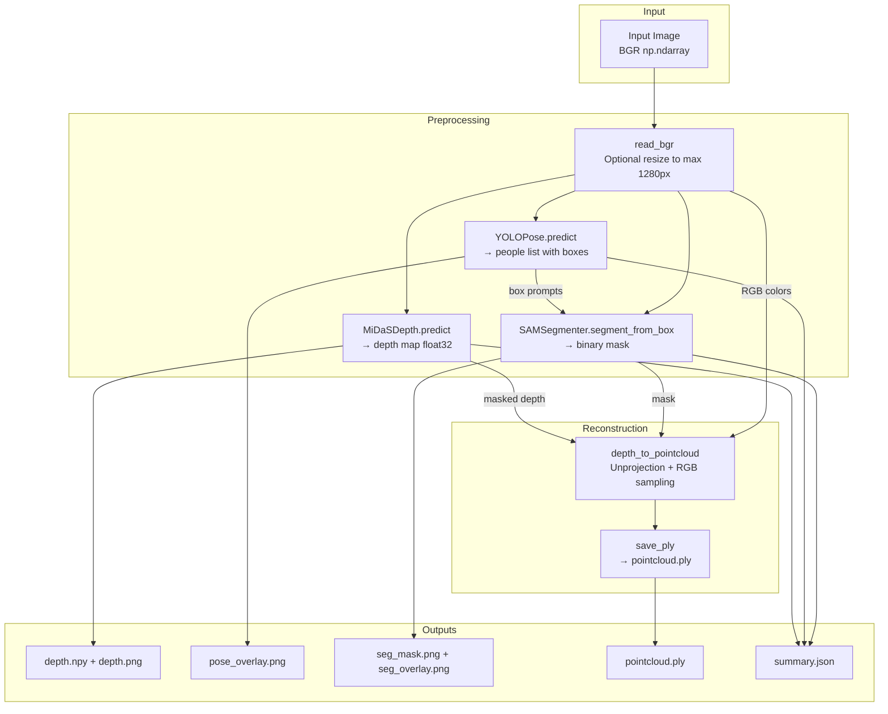
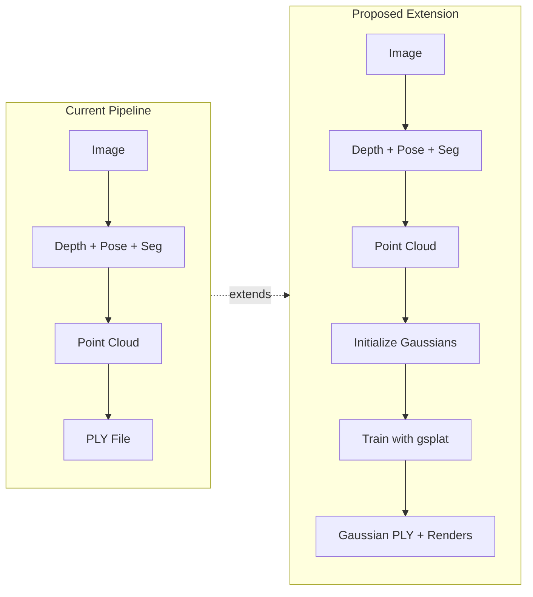

# Human3D Codebase Refactor Analysis

## 1. Directory Structure

```
src/human3d/
├── __init__.py                    # Package init (version only)
├── pipeline.py                    # Main orchestration class
├── run.bat                        # Windows batch runner
│
├── models/                        # Preprocessing Models
│   ├── depth_midas.py             # MiDaS depth estimation
│   ├── pose_yolo.py               # YOLOv8 pose detection
│   └── seg_sam.py                 # SAM segmentation
│
├── reconstruct/                   # 3D Reconstruction
│   └── pointcloud.py              # Depth → Point Cloud unprojection
│
├── utils/                         # Utilities
│   ├── config.py                  # YAML config loader
│   ├── device.py                  # CUDA/CPU device picker
│   └── io.py                      # File I/O helpers
│
└── viz/                           # Visualization
    └── overlays.py                # Depth viz, pose drawing, mask overlay
```

## 2. Key File Locations

| File | Path | Purpose |
|------|------|---------|
| `pipeline.py` | `src/human3d/pipeline.py` | Main orchestration class |
| `pointcloud.py` | `src/human3d/reconstruct/pointcloud.py` | Depth-to-3D unprojection |

## 3. Preprocessing Modules

### 3.1 MiDaS Depth Estimation (`models/depth_midas.py`)

```python
class MiDaSDepth:
    - Uses torch.hub to load Intel MiDaS models
    - Supports: DPT_Large, DPT_Hybrid, or small transforms
    - Input: BGR image (np.ndarray)
    - Output: float32 depth map (H, W) - relative/inverse depth
```

**Key Details:**
- Model loaded via `torch.hub.load("intel-isl/MiDaS", model_type)`
- Output is bicubic-interpolated to match input resolution
- Returns relative (not metric) depth values

### 3.2 YOLOv8 Pose Detection (`models/pose_yolo.py`)

```python
class YOLOPose:
    - Uses ultralytics YOLO for pose estimation
    - Input: BGR image (np.ndarray)
    - Output: dict with "people" list containing:
        - box_xyxy: (4,) float32 bounding box
        - conf: float confidence
        - keypoints_xy: (K, 2) float32 or None
        - keypoints_conf: (K,) float32 or None
```

**Key Details:**
- Default model: `yolov8n-pose.pt`
- Configurable confidence threshold (default 0.25)
- K = 17 keypoints (COCO format)

### 3.3 SAM Segmentation (`models/seg_sam.py`)

```python
class SAMSegmenter:
    - Uses Facebook's Segment Anything Model
    - Input: BGR image + box_xyxy prompt
    - Output: binary mask (H, W) uint8 {0, 1}
```

**Key Details:**
- Requires pre-downloaded checkpoint file
- Uses box prompts derived from pose detection
- Returns highest-scoring mask from multimask output

## 4. Current Data Flow



## 5. Core Unprojection Logic (pointcloud.py)

### 5.1 Depth Map to 3D Coordinates

```python
def depth_to_pointcloud(depth, bgr, fx, fy):
    # Step 1: Compute principal point (image center)
    h, w = depth.shape[:2]
    cx, cy = (w - 1) / 2.0, (h - 1) / 2.0

    # Step 2: Normalize depth to pseudo-metric range
    d = depth - np.nanmin(depth)
    d = d / (np.nanmax(d) + 1e-6)
    z = 0.5 + 2.0 * d  # Maps to ~0.5m to ~2.5m range

    # Step 3: Pinhole camera unprojection
    xs, ys = np.meshgrid(np.arange(w), np.arange(h))
    X = (xs - cx) * z / fx
    Y = (ys - cy) * z / fy
    Z = z
```

### 5.2 Camera Intrinsic Parameters

| Parameter | Value | Source |
|-----------|-------|--------|
| `fx` | 1000.0 (default) | Config: `reconstruction.pointcloud.fx` |
| `fy` | 1000.0 (default) | Config: `reconstruction.pointcloud.fy` |
| `cx` | `(width - 1) / 2` | Computed at runtime |
| `cy` | `(height - 1) / 2` | Computed at runtime |

**Note:** These are placeholder intrinsics. For accurate reconstruction, real camera calibration is needed.

### 5.3 Mask Application

The mask is applied **before** unprojection in `pipeline.py`:

```python
# In pipeline.py, line 250-254:
if mask01 is not None:
    depth_masked = depth.copy()
    depth_masked[mask01 == 0] = 0.0  # Zero out background
    pcd = depth_to_pointcloud(depth_masked, bgr, fx=fx, fy=fy)
```

In `pointcloud.py`, invalid points are filtered:
```python
mask = np.isfinite(pts).all(axis=1)  # Remove NaN/Inf
pts = pts[mask]
rgb = rgb[mask]
```

### 5.4 RGB Color Sampling

```python
# Direct 1:1 pixel mapping (no interpolation)
rgb = cv2.cvtColor(bgr, cv2.COLOR_BGR2RGB)  # BGR → RGB
rgb = rgb.reshape(-1, 3).astype(np.float32) / 255.0  # Normalize to [0,1]
```

## 6. Data Formats at Each Stage

| Stage | Format | Shape | dtype | Value Range |
|-------|--------|-------|-------|-------------|
| Input Image | BGR | (H, W, 3) | uint8 | [0, 255] |
| Depth Map | Relative depth | (H, W) | float32 | Arbitrary (higher = farther) |
| Depth Normalized | Pseudo-metric | (H, W) | float32 | [0.5, 2.5] meters |
| Segmentation Mask | Binary | (H, W) | uint8 | {0, 1} |
| Pose Boxes | XYXY coords | (N, 4) | float32 | Pixel coordinates |
| Pose Keypoints | XY coords | (N, 17, 2) | float32 | Pixel coordinates |
| Point Cloud XYZ | 3D coords | (M, 3) | float32 | Meters (pseudo) |
| Point Cloud RGB | Colors | (M, 3) | float32 | [0.0, 1.0] |
| PLY Output | Binary PLY | - | - | Open3D format |

## 7. Functions to Preserve/Reuse

### ✅ Keep As-Is

| Function | File | Reason |
|----------|------|--------|
| `MiDaSDepth` class | depth_midas.py | Clean MiDaS integration, well-structured |
| `YOLOPose` class | pose_yolo.py | Clean YOLO integration, good output format |
| `SAMSegmenter` class | seg_sam.py | Clean SAM integration, box prompts work well |
| `pick_device()` | device.py | Simple, reusable |
| `load_config()` | config.py | Simple YAML loader |
| `read_bgr()` | io.py | Good resize logic |
| `ensure_dir()` | io.py | Standard utility |
| `write_json()` | io.py | Standard utility |
| `save_png()` | io.py | Standard utility |
| `save_npy()` | io.py | Standard utility |
| `depth_to_vis()` | overlays.py | Good visualization |
| `draw_pose()` | overlays.py | Simple keypoint drawing |
| `overlay_mask()` | overlays.py | Good mask overlay |

### ⚠️ Modify/Extend

| Function | File | Changes Needed |
|----------|------|----------------|
| `depth_to_pointcloud()` | pointcloud.py | Add support for returning raw arrays (not just Open3D), add proper intrinsics handling |
| `save_ply()` | pointcloud.py | Keep but add alternative export via plyfile for Gaussian format |
| `Human3DPipeline.run()` | pipeline.py | Add Gaussian splatting branch after point cloud generation |

### 🔄 Replace/Extend

| Component | Current | Replacement/Extension |
|-----------|---------|----------------------|
| Point cloud output | Open3D PLY only | Add Gaussian splat PLY format |
| Reconstruction module | `reconstruct/pointcloud.py` only | Add `reconstruct/gaussian.py` for 3DGS |
| Pipeline output | PLY file only | Add trained Gaussian model + renders |

## 8. Recommended New Files for Gaussian Splatting

```
src/human3d/
├── reconstruct/
│   ├── pointcloud.py      # (existing)
│   ├── gaussian.py        # NEW: Gaussian initialization from point cloud
│   └── trainer.py         # NEW: gsplat training loop
│
├── models/
│   ├── gaussian_model.py  # NEW: Gaussian splat model (positions, colors, scales, etc.)
│   └── loss.py            # NEW: LPIPS + L1/L2 losses
│
└── utils/
    ├── cameras.py         # NEW: Camera intrinsics/extrinsics handling
    └── ply_gaussian.py    # NEW: Gaussian-specific PLY I/O
```

## 9. Architecture Diagram (Current vs. Proposed)



## 10. Configuration Extension Needed

```yaml
# Add to existing config:
gaussian_splatting:
  enabled: true
  init:
    position_noise: 0.01      # Jitter for initial positions
    scale_init: 0.01          # Initial Gaussian scale
    opacity_init: 0.5         # Initial opacity
  training:
    iterations: 1000
    lr_position: 0.001
    lr_color: 0.01
    lr_scale: 0.005
    lr_opacity: 0.01
    lr_rotation: 0.001
    loss_weights:
      l1: 1.0
      lpips: 0.1
  output:
    save_ply: true
    save_renders: true
    render_resolution: [512, 512]
```
