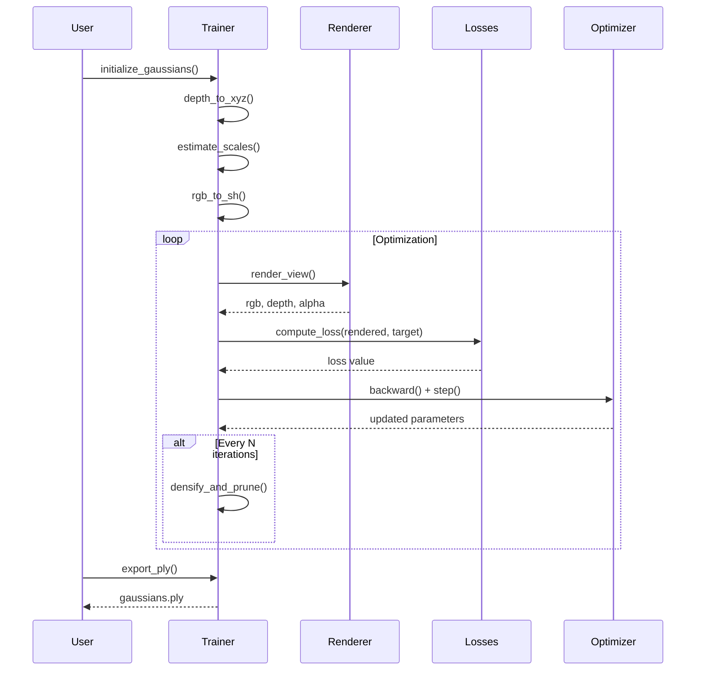

# Gaussian Splatting Technical Documentation

> Comprehensive guide to the 3D Gaussian Splatting implementation in Human3D

## Table of Contents

- [Overview](#overview)
- [Architecture](#architecture)
- [Mathematical Background](#mathematical-background)
- [Implementation Details](#implementation-details)
- [Hyperparameter Tuning](#hyperparameter-tuning)
- [Troubleshooting](#troubleshooting)
- [Comparison with Point Clouds](#comparison-with-point-clouds)
- [API Reference](#api-reference)

---

## Overview

### What is Gaussian Splatting?

3D Gaussian Splatting (3DGS) is a novel approach to 3D scene representation that models scenes as collections of 3D Gaussian primitives. Unlike traditional mesh or point cloud representations, Gaussians provide:

1. **Continuous surfaces** - No holes or gaps in rendered views
2. **Differentiable rendering** - Parameters can be optimized via gradient descent
3. **View-dependent effects** - Spherical harmonics encode specular reflections
4. **Real-time rendering** - GPU-accelerated tile-based rasterization

### Why Gaussian Splatting for Human Reconstruction?

| Challenge | How 3DGS Solves It |
|-----------|-------------------|
| Sparse depth data | Gaussians interpolate between samples |
| Depth noise | Optimization refines initial positions |
| Clothing details | Fine Gaussians capture texture |
| Novel viewpoints | Trained representation generalizes |

### Pipeline Summary

```
Input Image → Depth Estimation → Initialize Gaussians → Optimize → Export PLY
     ↓              ↓                    ↓                ↓          ↓
  RGB-D        MiDaS/ZoeDepth      From point cloud    Minimize    View in
  fusion                                               loss        browser
```

---

## Architecture

### Component Diagram

```
┌─────────────────────────────────────────────────────────────────────────────┐
│                           GaussianTrainer                                   │
├─────────────────────────────────────────────────────────────────────────────┤
│                                                                             │
│  ┌──────────────┐    ┌──────────────┐    ┌──────────────┐                  │
│  │   Inputs     │    │  Parameters  │    │   Modules    │                  │
│  ├──────────────┤    ├──────────────┤    ├──────────────┤                  │
│  │ • RGB image  │    │ • means (N,3)│    │ • Renderer   │                  │
│  │ • Depth map  │    │ • scales     │    │   (gsplat)   │                  │
│  │ • Mask       │    │ • rotations  │    │ • Losses     │                  │
│  │ • Camera     │    │ • sh_coeffs  │    │ • Densifier  │                  │
│  │ • Config     │    │ • opacities  │    │ • Exporter   │                  │
│  └──────────────┘    └──────────────┘    └──────────────┘                  │
│                                                                             │
│  ┌─────────────────────────────────────────────────────────────────────┐   │
│  │                        Optimization Loop                             │   │
│  │                                                                      │   │
│  │   render() → compute_loss() → backward() → optimizer.step()         │   │
│  │       ↑                                          │                   │   │
│  │       └──────────────────────────────────────────┘                   │   │
│  │                                                                      │   │
│  │   Every N iterations: densify_and_prune()                           │   │
│  └─────────────────────────────────────────────────────────────────────┘   │
│                                                                             │
└─────────────────────────────────────────────────────────────────────────────┘
```

### File Structure

```
src/human3d/
├── reconstruct/
│   ├── gaussian_trainer.py    # Main trainer class
│   │   ├── GaussianConfig     # Training configuration
│   │   ├── CameraParams       # Camera intrinsics
│   │   └── GaussianTrainer    # Optimization loop
│   │
│   ├── gaussian_utils.py      # Utility functions
│   │   ├── depth_to_xyz()     # Unproject depth to 3D
│   │   ├── estimate_scales()  # k-NN scale estimation
│   │   ├── rgb_to_sh()        # Convert to spherical harmonics
│   │   └── quaternion ops     # Rotation utilities
│   │
│   └── losses.py              # Loss functions
│       ├── l1_loss()          # Photometric L1
│       ├── ssim_loss()        # Structural similarity
│       └── GaussianLosses     # Combined loss class
│
└── export/
    └── ply_exporter.py        # PLY file export
        ├── save_gaussian_ply()
        └── load_gaussian_ply()
```

### Data Flow



---

## Mathematical Background

### Gaussian Representation

Each 3D Gaussian is parameterized by:

#### Position (Mean)
$$\mu \in \mathbb{R}^3$$

The center of the Gaussian in world coordinates.

#### Covariance Matrix
$$\Sigma = RSS^TR^T \in \mathbb{R}^{3 \times 3}$$

Where:
- $R$ is a rotation matrix (from quaternion $q \in \mathbb{R}^4$)
- $S = \text{diag}(s_x, s_y, s_z)$ is a diagonal scaling matrix

We store $\log(s)$ for unconstrained optimization.

#### Spherical Harmonics (Color)

Color is encoded using spherical harmonics up to degree $l$:

$$c(\mathbf{d}) = \sum_{l=0}^{L} \sum_{m=-l}^{l} c_{l}^{m} Y_{l}^{m}(\mathbf{d})$$

Where:
- $\mathbf{d}$ is the view direction
- $Y_{l}^{m}$ are spherical harmonic basis functions
- $c_{l}^{m}$ are the learned coefficients

| Degree | Coefficients | Effect |
|--------|--------------|--------|
| 0 | 1 | Base color (Lambertian) |
| 1 | 4 | Directional shading |
| 2 | 9 | Specular highlights |
| 3 | 16 | High-frequency effects |

#### Opacity
$$\alpha = \sigma(\alpha_{raw}) \in [0, 1]$$

Stored in logit space for unconstrained optimization.

### Differentiable Rasterization

The rendering equation for pixel $p$:

$$C(p) = \sum_{i \in \mathcal{N}} c_i \alpha_i \prod_{j=1}^{i-1}(1 - \alpha_j)$$

Where:
- $\mathcal{N}$ is the set of Gaussians overlapping pixel $p$
- $c_i$ is the color of Gaussian $i$
- $\alpha_i$ is the opacity contribution

#### Projection to 2D

The 3D covariance $\Sigma$ is projected to 2D:

$$\Sigma' = JW\Sigma W^TJ^T$$

Where:
- $W$ is the world-to-camera transformation
- $J$ is the Jacobian of the projective transformation

### Loss Functions

#### L1 Photometric Loss
$$\mathcal{L}_{L1} = \frac{1}{|\mathcal{M}|} \sum_{p \in \mathcal{M}} |I_{pred}(p) - I_{gt}(p)|$$

#### SSIM Loss
$$\mathcal{L}_{SSIM} = 1 - \text{SSIM}(I_{pred}, I_{gt})$$

$$\text{SSIM}(x, y) = \frac{(2\mu_x\mu_y + C_1)(2\sigma_{xy} + C_2)}{(\mu_x^2 + \mu_y^2 + C_1)(\sigma_x^2 + \sigma_y^2 + C_2)}$$

#### Combined Loss
$$\mathcal{L} = (1-\lambda)\mathcal{L}_{L1} + \lambda\mathcal{L}_{SSIM}$$

Typically $\lambda = 0.2$.

### Densification Algorithm

The adaptive density control algorithm:

```
for each Gaussian i:
    grad_magnitude = ||∂L/∂μ_i||

    if grad_magnitude > threshold:
        if scale_i > median_scale:
            # SPLIT: Create 2 smaller Gaussians
            new_scale = scale_i / 1.6
            new_positions = μ_i ± offset
        else:
            # CLONE: Duplicate with slight offset
            new_position = μ_i + small_noise
            new_scale = scale_i

    if opacity_i < opacity_threshold:
        # PRUNE: Remove this Gaussian
        delete(Gaussian_i)
```

#### Why This Works

- **High gradient + small scale** → Under-reconstruction, need more Gaussians → Clone
- **High gradient + large scale** → Blurry coverage, need finer detail → Split
- **Low opacity** → Contributing little to image → Prune

---

## Implementation Details

### Initialization

Gaussians are initialized from the depth map:

```python
def initialize_gaussians(rgb, depth, mask, camera):
    # 1. Unproject depth to 3D points
    xyz = depth_to_xyz(depth, mask, fx, fy, cx, cy)

    # 2. Sample colors from image
    colors = rgb[mask > 0]

    # 3. Estimate scales via k-NN
    scales = estimate_point_scales(xyz, k=8)

    # 4. Convert to optimization-friendly format
    means = xyz                          # (N, 3)
    log_scales = log(scales)             # (N, 3)
    rotations = [1, 0, 0, 0]             # Identity quaternion
    sh_coeffs = rgb_to_sh(colors)        # (N, K, 3)
    logit_opacities = inverse_sigmoid(0.9)

    return means, log_scales, rotations, sh_coeffs, logit_opacities
```

### Rendering Pipeline

```python
def render_view(gaussians, camera):
    # Transform Gaussians to camera space
    means_cam = transform(gaussians.means, camera.pose)

    # Project covariance to 2D
    cov_2d = project_covariance(gaussians.cov, camera)

    # Tile-based rasterization (GPU)
    rgb, depth, alpha = rasterize(
        means=means_cam,
        cov_2d=cov_2d,
        colors=sh_to_rgb(gaussians.sh, view_dir),
        opacities=sigmoid(gaussians.opacities),
        width=camera.width,
        height=camera.height,
    )

    return rgb, depth, alpha
```

### PLY Export Format

The PLY file structure for 3DGS compatibility:

```
ply
format binary_little_endian 1.0
element vertex N
property float x
property float y
property float z
property float nx
property float ny
property float nz
property float f_dc_0        # DC component (red)
property float f_dc_1        # DC component (green)
property float f_dc_2        # DC component (blue)
property float f_rest_0      # Higher-order SH (if degree > 0)
...
property float f_rest_44     # Up to 45 rest coefficients for degree 3
property float opacity
property float scale_0
property float scale_1
property float scale_2
property float rot_0         # Quaternion w
property float rot_1         # Quaternion x
property float rot_2         # Quaternion y
property float rot_3         # Quaternion z
end_header
[binary data]
```

---

## Hyperparameter Tuning

### Learning Rates

| Parameter | Default | Range | Effect of Increase |
|-----------|---------|-------|-------------------|
| `lr_position` | 1.6e-4 | 1e-5 to 1e-3 | Faster position updates, may oscillate |
| `lr_scale` | 5e-3 | 1e-4 to 1e-2 | Gaussians resize faster |
| `lr_rotation` | 1e-3 | 1e-4 to 1e-2 | Faster orientation changes |
| `lr_color` | 2.5e-3 | 1e-4 to 1e-2 | Color updates faster |
| `lr_opacity` | 5e-2 | 1e-3 to 1e-1 | Transparency changes faster |

**Recommended starting point:**
```python
config = GaussianConfig(
    lr_position=1.6e-4,
    lr_scale=5e-3,
    lr_rotation=1e-3,
    lr_color=2.5e-3,
    lr_opacity=5e-2,
)
```

### Iteration Count

| Scenario | Iterations | Notes |
|----------|------------|-------|
| Quick preview | 500-1000 | Visible artifacts |
| Standard quality | 3000-5000 | Good balance |
| High quality | 10000+ | Diminishing returns |

### Densification Settings

| Parameter | Default | Purpose |
|-----------|---------|---------|
| `densify_from_iter` | 500 | Allow initial settling |
| `densify_until_iter` | 3000 | Stop before final refinement |
| `densify_interval` | 100 | How often to check |
| `densify_grad_threshold` | 0.0002 | Lower = more Gaussians |
| `prune_opacity_threshold` | 0.005 | Higher = more pruning |
| `max_gaussians` | 100000 | Memory limit |

### Memory vs Quality Tradeoffs

| Setting | Memory | Quality | Speed |
|---------|--------|---------|-------|
| SH degree 0 | Low | Good | Fast |
| SH degree 3 | 4x higher | Better view-dependent | 2x slower |
| 10K Gaussians | ~500 MB | Medium | Fast |
| 100K Gaussians | ~2 GB | High | Medium |
| 500K Gaussians | ~8 GB | Very high | Slow |

---

## Troubleshooting

### Common Issues

#### 1. "CUDA out of memory"

**Cause:** Too many Gaussians or high SH degree

**Solutions:**
```python
# Reduce max Gaussians
config = GaussianConfig(max_gaussians=50000)

# Use lower SH degree
config = GaussianConfig(sh_degree=0)

# Reduce image resolution
rgb_small = cv2.resize(rgb, (256, 256))
```

#### 2. "NaN loss during training"

**Cause:** Exploding gradients or numerical instability

**Solutions:**
```python
# Reduce learning rates
config = GaussianConfig(
    lr_position=1e-5,
    lr_scale=1e-4,
)

# Enable gradient clipping (already default)
torch.nn.utils.clip_grad_norm_(params, max_norm=1.0)
```

#### 3. "Blurry or blobby output"

**Cause:** Not enough Gaussians or insufficient iterations

**Solutions:**
```python
# Lower densification threshold (more splits)
config = GaussianConfig(densify_grad_threshold=0.0001)

# Increase iterations
trainer.optimize(num_iterations=5000)
```

#### 4. "Holes in rendering"

**Cause:** Gaussians pruned too aggressively

**Solutions:**
```python
# Lower prune threshold
config = GaussianConfig(prune_opacity_threshold=0.001)

# Higher initial opacity
config = GaussianConfig(opacity_init=0.95)
```

#### 5. "gsplat not using GPU"

**Cause:** CUDA_HOME not set

**Solution:**
```python
import os
os.environ['CUDA_HOME'] = r'C:\Program Files\NVIDIA GPU Computing Toolkit\CUDA\v13.1'
# Then import gsplat
```

### Debugging Checklist

- [ ] Check `torch.cuda.is_available()` returns True
- [ ] Verify input shapes: RGB (H, W, 3), Depth (H, W), Mask (H, W)
- [ ] Ensure mask has non-zero pixels
- [ ] Check depth values are positive and finite
- [ ] Verify camera intrinsics match image dimensions
- [ ] Monitor loss curve for convergence
- [ ] Inspect intermediate renders for quality

### Performance Optimization

1. **Use CUDA device:**
   ```python
   trainer = GaussianTrainer(..., device="cuda")
   ```

2. **Reduce render resolution during training:**
   ```python
   # Train on 256x256, export full resolution
   ```

3. **Skip SSIM loss for speed:**
   ```python
   config = GaussianConfig(loss_weight_ssim=0.0, loss_weight_l1=1.0)
   ```

4. **Batch process multiple images:**
   ```python
   for img in images:
       trainer.optimize(num_iterations=1000)
       trainer.export_ply(f"output_{i}.ply")
   ```

---

## Comparison with Point Clouds

### Representation Comparison

| Aspect | Point Cloud | Gaussian Splatting |
|--------|-------------|-------------------|
| **Primitive** | 3D point | 3D Gaussian |
| **Color** | RGB per point | Spherical harmonics |
| **Size** | None (infinitesimal) | 3D covariance matrix |
| **Orientation** | None | Rotation quaternion |
| **Transparency** | None (opaque) | Per-Gaussian opacity |

### Rendering Comparison

```
Point Cloud Rendering:
┌─────────────────────┐
│  • • • • • • • • •  │  ← Individual points
│  • • •   • • • • •  │  ← Gaps visible
│  • • • • •   • • •  │  ← No interpolation
│  • • • • • • • • •  │
└─────────────────────┘

Gaussian Splatting Rendering:
┌─────────────────────┐
│ ████████████████████│  ← Smooth coverage
│ ████████████████████│  ← Gaussians overlap
│ ████████████████████│  ← Continuous surface
│ ████████████████████│
└─────────────────────┘
```

### When to Use Each

| Use Case | Recommendation |
|----------|----------------|
| Quick visualization | Point Cloud |
| CAD/engineering import | Point Cloud |
| Novel view synthesis | Gaussian Splatting |
| VR/AR applications | Gaussian Splatting |
| Real-time rendering | Gaussian Splatting |
| Large-scale scenes | Point Cloud (lower memory) |
| High-quality renders | Gaussian Splatting |

### Conversion Between Formats

Point Cloud → Gaussians:
```python
# Initialize Gaussians from point cloud
xyz = load_pointcloud("input.ply")
scales = estimate_scales(xyz)
trainer.means = nn.Parameter(xyz)
trainer.scales = nn.Parameter(log(scales))
```

Gaussians → Point Cloud:
```python
# Sample points from Gaussians
points = trainer.means.detach().cpu().numpy()
save_pointcloud(points, "output.ply")
```

---

## API Reference

### GaussianTrainer

```python
class GaussianTrainer:
    """
    Main class for training 3D Gaussians from RGB-D input.

    Args:
        rgb: Input RGB image (H, W, 3)
        depth: Depth map (H, W)
        mask: Binary mask (H, W)
        camera_params: Camera intrinsics
        config: Training configuration
        device: 'cuda' or 'cpu'

    Methods:
        initialize_gaussians() -> int: Initialize from depth
        optimize(num_iterations) -> dict: Run training loop
        render_view(camera_pose) -> tuple: Render from viewpoint
        export_ply(path): Save to PLY file

    Properties:
        num_gaussians: Current Gaussian count
        means, scales, rotations, sh_coeffs, opacities: Parameters
    """
```

### GaussianConfig

```python
@dataclass
class GaussianConfig:
    """
    Configuration for Gaussian training.

    Attributes:
        num_iterations: Total training iterations
        lr_position: Learning rate for positions
        lr_color: Learning rate for SH coefficients
        lr_scale: Learning rate for scales
        lr_opacity: Learning rate for opacity
        lr_rotation: Learning rate for rotations
        loss_weight_l1: Weight for L1 loss
        loss_weight_ssim: Weight for SSIM loss
        densify_from_iter: Start densification iteration
        densify_until_iter: Stop densification iteration
        densify_interval: Iterations between densification
        densify_grad_threshold: Gradient threshold for densification
        prune_opacity_threshold: Minimum opacity to keep
        max_gaussians: Maximum number of Gaussians
        scale_init: Initial Gaussian scale
        opacity_init: Initial opacity value
        position_noise: Noise added to initial positions
        sh_degree: Spherical harmonics degree (0-3)
    """
```

### CameraParams

```python
@dataclass
class CameraParams:
    """
    Camera intrinsic parameters.

    Attributes:
        fx: Focal length X (pixels)
        fy: Focal length Y (pixels)
        cx: Principal point X (pixels)
        cy: Principal point Y (pixels)
        width: Image width
        height: Image height
        world_to_camera: 4x4 transformation matrix
    """
```

### Export Functions

```python
def save_gaussian_ply(
    means: np.ndarray,      # (N, 3)
    scales: np.ndarray,     # (N, 3) log-space
    rotations: np.ndarray,  # (N, 4) quaternions
    sh_coeffs: np.ndarray,  # (N, K, 3)
    opacities: np.ndarray,  # (N,) sigmoid-activated
    filepath: str | Path,
) -> None:
    """Save Gaussians to PLY file."""

def load_gaussian_ply(filepath: str | Path) -> dict:
    """Load Gaussians from PLY file."""
```

---

## References

1. Kerbl, B., et al. "3D Gaussian Splatting for Real-Time Radiance Field Rendering." SIGGRAPH 2023.
2. gsplat library: https://github.com/nerfstudio-project/gsplat
3. Original 3DGS: https://repo-sam.inria.fr/fungraph/3d-gaussian-splatting/

---

<p align="center">
  <i>Documentation last updated: February 2026</i>
</p>
